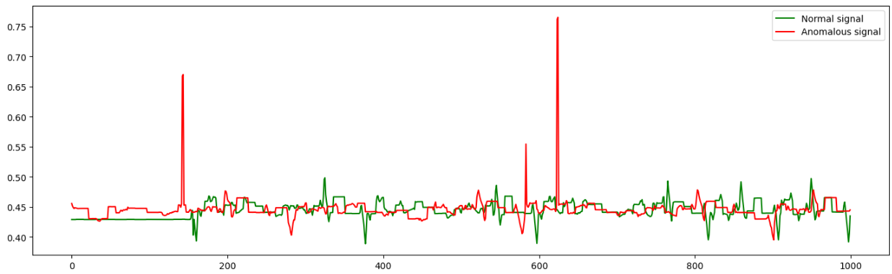

# Detection of Anomalous Behavior in Industrial Robot

## Project Overview

This project addresses **time-series anomaly detection** in multivariate sensor data from an **Industrial Kuka Robot**. The goal is to develop and evaluate deep learning models, specifically Autoencoders (AE) and Adversarial Autoencoders (AAE), capable of identifying abnormal behavior (the robot slowing down) based on a high reconstruction error.

The models are trained exclusively on **normal operational data** to learn a compact, meaningful representation of the robot's healthy state.

---

## Methodology and Models

The project evaluates four main models, exploring the impact of architecture (LSTM vs. Convolutional) and feature engineering (Raw vs. PCA-reduced).

### 1. Traditional Autoencoders (AE)
These models are trained to minimize the reconstruction error of normal data.
* **LSTM-AE:** Uses Long Short-Term Memory (LSTM) layers, suitable for capturing temporal dependencies in sequence data.
* **Conv-AE:** Uses 1-D Convolutional layers for feature extraction in the time dimension.

### 2. Adversarial Autoencoders (AAE)
These models incorporate an adversarial component (a Discriminator) to enforce a Gaussian distribution on the latent space, which is theorized to improve separation between normal and anomalous samples.
* **LSTM-AAE** and **Conv-AAE** architectures were implemented.

### Preprocessing Techniques

These techniques were applied to prepare the time-series data for model training:

| Preprocessing Technique | Purpose | Key Parameter/Result |
| :--- | :--- | :--- |
| **Windowing** | To transform the raw time-series into structured sequences required for LSTM and Convolutional network inputs. | Window size of **20 samples** was used. |
| **Dimensionality Reduction (PCA)** | To reduce the feature space of the high-dimensional sensor readings. | **20 components** were retained, explaining **95%** of the original variance. |

---

## Key Results and Discussion

The models were evaluated using the **F1-score** to handle the highly imbalanced nature of the anomaly detection task.

| Model | Feature Input | F1-Score |
| :--- | :--- | :--- |
| **LSTM-AE** | 86 components | **0.73 (Best Result)** |
| **Conv-AE** | 86 components | 0.71 |
| **Conv-AAE** | PCA (20 components) | 0.66 |

* **Conclusion:** The **LSTM-based Traditional Autoencoder** using the full 86 sensor features achieved the highest F1-score (0.73).
* **Observation:** The adversarial component of the AAEs did not consistently improve performance, a result possibly due to the complexities of adversarial training. PCA was beneficial for the Conv-AAE, increasing its performance to 0.66 from 0.46 (without reduction).

### Authors

* Gabriele Cassetta
* Arefeh Mohammad Nejad
* Gemma Loreti
